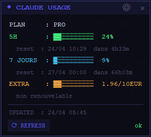

```
███████╗██╗  ██╗██╗     ██╗██████╗     ██████╗ ██╗██╗  ██╗██╗
██╔════╝██║ ██╔╝██║     ██║██╔══██╗    ██╔══██╗██║╚██╗██╔╝██║
█████╗  █████╔╝ ██║     ██║██║  ██║    ██████╔╝██║ ╚███╔╝ ██║
██╔══╝  ██╔═██╗ ██║     ██║██║  ██║    ██╔═══╝ ██║ ██╔██╗ ██║
███████╗██║  ██╗███████╗██║██████╔╝    ██║     ██║██╔╝ ██╗███████╗
╚══════╝╚═╝  ╚═╝╚══════╝╚═╝╚═════╝    ╚═╝     ╚═╝╚═╝  ╚═╝╚══════╝
                     · P R O D U C T I O N ·
```

---

```
 ██████╗██╗      █████╗ ██╗   ██╗██████╗ ██╗   ██╗███████╗
██╔════╝██║     ██╔══██╗██║   ██║██╔══██╗██║   ██║██╔════╝
██║     ██║     ███████║██║   ██║██║  ██║██║   ██║███████╗
██║     ██║     ██╔══██║██║   ██║██║  ██║╚██╗ ██╔╝╚════██║
╚██████╗███████╗██║  ██║╚██████╔╝██████╔╝ ╚████╔╝ ███████║
 ╚═════╝╚══════╝╚═╝  ╚═╝ ╚═════╝ ╚═════╝   ╚═══╝  ╚══════╝
```

> Widget Python · overlay Bureau · usage Claude.ai en temps réel

---

<p align="center">
  
</p>

---

## Ce que c'est

Claud'Us est un petit widget qui se pose sur le Bureau Windows et affiche en un coup d'œil l'état de ton forfait Claude.ai — sans ouvrir le navigateur.

Claude.ai (plan Pro/Max) limite l'usage sur deux fenêtres glissantes : **5 heures** et **7 jours**. Impossible de savoir où on en est sans aller fouiller dans les réglages. Claud'Us règle ça.

---

## Fonctionnalités

### Affichage en temps réel
| Indicateur | Description |
|---|---|
| **PLAN** | Plan actif : Pro · Max 5× · Max 20× |
| **5H** | Taux d'utilisation sur la fenêtre glissante de 5 heures |
| **7 JOURS** | Taux d'utilisation sur la fenêtre glissante de 7 jours |
| **EXTRA** | Crédits supplémentaires achetés (hors forfait), affichés en € |

Chaque indicateur inclut :
- une **barre de progression** caractère par caractère (`▓▓▓░░░░░░░`)
- le **pourcentage** exact
- l'**heure de réinitialisation** locale (`jj/mm HH:MM`)
- un **compte à rebours** dynamique (`dans 4h33m`) mis à jour toutes les 30 secondes sans appel réseau

### Crédits EXTRA
- Affichage `X.XX/YY EUR` (conversion automatique depuis les unités API)
- Détection automatique si les crédits sont **renouvelables** ou **non renouvelables**
- Si renouvelables : affichage du montant d'auto-recharge et du **compteur de recharges du mois**

### Interface
- Fenêtre **sans bordure**, toujours au premier plan, **transparence à 93%**
- **Draggable** (glisser depuis l'en-tête ou le corps)
- Positionnement automatique en **bas à droite** de l'écran au démarrage
- **Icône système** (system tray) avec menu : Afficher / Masquer / Reconfigurer / Quitter
- Bouton **⚙** pour reconfigurer les cookies sans relancer
- Bouton **⟳ REFRESH** pour forcer un rafraîchissement immédiat
- Rafraîchissement automatique toutes les **15 minutes**
- Cache local : affichage instantané au démarrage, même sans réseau

### Sécurité
- Les cookies sont stockés localement dans `~/.claudus_cookie.json`
- Aucune donnée transmise à un serveur tiers
- Utilise `curl_cffi` (impersonation Chrome) pour contourner Cloudflare

---

## Installation

```bash
pip install customtkinter curl_cffi pystray Pillow
```

ou via le script fourni :

```bat
install.bat
```

---

## Configuration

Au premier lancement, Claud'Us demande deux cookies de session Claude.ai.

**Comment les obtenir :**

1. Ouvre [claude.ai](https://claude.ai) dans Chrome
2. `F12` → onglet **Application** → **Cookies** → `https://claude.ai`
3. Copie les valeurs de :
   - `sessionKey`
   - `cf_clearance`

Ces valeurs sont stockées dans `~/.claudus_cookie.json` et réutilisées à chaque démarrage.

> Pour les mettre à jour : clic sur **⚙** dans l'en-tête du widget.

---

## Lancement

```bat
claudus.bat
```

ou directement :

```bash
pythonw widget.py
```

---

## Changelog

### v1.2 — Claud'Us
- Renommage du projet : **Claud'Us**
- Ajout de la ligne **EXTRA** : crédits supplémentaires hors forfait
  - Affichage en euros (`used / 200`)
  - Statut renouvelable / non renouvelable
  - Compteur de recharges automatiques du mois
- Correction de la conversion EUR (diviseur 200, pas 100)
- Positionnement fenêtre ajusté (offset bas/droite configurable)
- Fichiers cache/cookie renommés `~/.claudus_*`

### v1.1
- Compte à rebours en temps réel sur les resets (toutes les 30s, sans appel réseau)
- Bouton **⚙** de reconfiguration des cookies
- Icône system tray avec menu complet
- Fenêtre positionnée automatiquement en bas à droite au démarrage
- Cache local : affichage immédiat au démarrage depuis la dernière valeur connue

### v1.0
- Premier release public
- Widget overlay sans bordure, toujours au premier plan
- Affichage **5H** et **7 JOURS** avec barres de progression et pourcentages
- Heure de reset locale pour chaque fenêtre
- Rafraîchissement automatique toutes les 15 minutes
- Authentification par cookies `sessionKey` + `cf_clearance`
- Icône system tray basique

---

## Stack technique

- Python 3.10+
- `tkinter` / `customtkinter` — UI
- `curl_cffi` — requêtes HTTP avec impersonation Chrome (bypass Cloudflare)
- `pystray` — icône system tray
- `Pillow` — icône tray générée dynamiquement
- API interne `claude.ai` — endpoint `/api/organizations/{uuid}/usage`

---

## Licence

Projet open source — usage libre.  
Fait avec ☕ par **eKLiD PiXL Production**  
[ko-fi.com/eklid](https://ko-fi.com/eklid)
